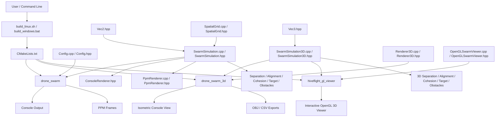
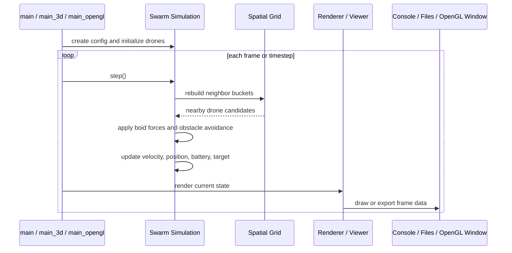

# HiveFlight
### Core Capabilities
- **30 autonomous drones** in 3D space (200×200×150 world)
- **Reynolds Boids Algorithm** with 5 weighted behaviors in 3D
- **Obstacle avoidance** with spherical obstacles
- **Target seeking** with 3D spiral movement pattern
- **Battery management** with velocity-based energy drain
- **60 FPS simulation** for smooth dynamics
## Simulation Dynamics

### Behavior Forces (3D Extensions)

1. **Separation Force**
   - Prevents drone crowding
   - Repulsion within 30 unit radius
   - Distance-weighted magnitude

2. **Alignment Force**
   - Drones align velocities with neighbors
   - Perception radius: 80 units
   - Creates coordinated movement

3. **Cohesion Force**
   - Attraction to neighbor swarm center
   - Keeps group together
   - Prevents fragmentation

4. **Target Seeking Force**
   - Continuous attraction to target
   - 3D spiral movement pattern (period: ~20 seconds)
   - Overrides other behaviors when weighted high

5. **Obstacle Avoidance Force**
   - Repulsion from spherical obstacles
   - Strongest force weight (2.5)
   - Safety buffer: 3.0 unit
## Architecture Diagram



### Runtime Flow


HiveFlight provides:

- **2D swarm simulation** (Reynolds Boids variant)
- **3D swarm simulation** (acceleration-based Reynolds Boids in a bounded 3D volume)
- **Visualization** in two forms:
  - Console **ASCII** renderers (2D + 3D)
  - Optional **interactive OpenGL** viewer for 3D
- **Export** for 3D simulation results:
  - **OBJ** for geometry visualization
  - **CSV** for analysis

At a high level, the pipeline is:

1. `Config` (or `SwarmConfig3D`) defines world + swarm parameters
2. `SwarmSimulation` / `SwarmSimulation3D` updates drone states each tick
3. A renderer (console/OBJ/CSV/OpenGL) consumes the updated state

---

## Build / targets (CMake)

The root CMake file (`HiveFlight/CMakeLists.txt`) builds these executables:

- `drone_swarm` (2D)
- `drone_swarm_3d` (3D console + export)
- `hiveflight_gl_viewer` (optional, interactive OpenGL)

OpenGL viewer is guarded by:

- `option(HIVEFLIGHT_BUILD_OPENGL_VIEWER ... ON)`
- presence of OpenGL + GLUT (+ optional GLU)

## Building

### Prerequisites
- C++17 compiler (g++, clang, or MSVC)
- CMake 3.10+
- Standard C++ library

### Build Commands

**Linux/WSL:**
```bash
cd HiveFlight
bash build_linux.sh
```

**Windows (with MinGW):**
```cmd
cd HiveFlight
build_windows.bat
```
## Installation Quick Start

```bash
# Clone/extract project
cd HiveFlight

# Build
bash build_linux.sh

# Run 2D
./build/drone_swarm --config swarm_demo.conf

# Run 3D
./build/drone_swarm_3d --drones 30

# Export 3D
./build/drone_swarm_3d --export obj output.obj
```
### Interactive OpenGL 3D Viewer

If OpenGL and GLUT/freeglut are available when CMake configures the project, an
extra executable is built:

```bash
cd {your project folder}/HiveFlight/build
./hiveflight_gl_viewer --drones 60 --seed 7
```

Common Linux dependencies:

```bash
sudo apt install freeglut3-dev libglu1-mesa-dev
```

Viewer controls:

- Mouse drag: orbit camera
- Mouse wheel: zoom
- Arrow keys: orbit camera
- Space: pause/resume
- R: reset simulation
- V: toggle velocity vectors
- +/-: change simulation speed
- 0: reset camera
- Q or Esc: quit

## Quick component map

| Functionality | 2D | 3D | OpenGL |
|---|---|---|---|
| Simulation engine | `SwarmSimulation` | `SwarmSimulation3D` | (uses `SwarmSimulation3D`) |
| Neighbor acceleration | `SpatialGrid` | (not yet) | (not yet) |
| Console render | `ConsoleRenderer.hpp` | `Renderer3D::printConsole` | (no) |
| Export | (PPM optional) | `Renderer3D::exportOBJ/exportCSV` | (no) |
| Interactive 3D | (none) | (ASCII only) | `OpenGLSwarmViewer` |
---
## Data Flow

```
┌─────────────────────────────────────┐
│   Configuration (swarm_demo.conf)   │
└────────────┬────────────────────────┘
             │
             ▼
┌─────────────────────────────────────┐
│   SimConfig (parameters)            │
└────────────┬────────────────────────┘
             │
             ▼
┌─────────────────────────────────────┐
│   SwarmSimulation (engine)          │
│  ├─ Drones[]                        │
│  ├─ Obstacles[]                     │
│  ├─ Target (Vec2)                   │
│  └─ SpatialGrid                     │
└────────────┬────────────────────────┘
             │
             ▼
   ┌─────────────────────┐
   │  Physics Step       │
   │  - Calculate forces │
   │  - Update velocity  │
   │  - Update position  │
   │  - Drain battery    │
   └─────────┬───────────┘
             │
    ┌────────┴────────┐
    ▼                 ▼
┌──────────────┐  ┌──────────────┐
│ Console      │  │ PPM Renderer │
│ Renderer     │  │ (optional)   │
└──────────────┘  └──────────────┘
```

## 5. Optional OpenGL Visualization (3D Viewer)

HiveFlight also includes an **interactive OpenGL-based viewer** (`hiveflight_gl_viewer`) that renders the same 3D swarm state using real 3D graphics.


### OpenGL Viewer Executable
- **Target**: `hiveflight_gl_viewer`
- **Entry**: `main_opengl.cpp`

### Key Components
- `OpenGLSwarmViewer.cpp/.hpp`
  - Handles window/display (`display()`, `reshape()`)
  - Draws scene elements: world box, grid, obstacles, target, drones, overlays
  - Implements camera + interaction: keyboard/special/mouse/timer

### Data Flow (Simulation → OpenGL)

```
┌───────────────────────┐
│      SwarmSimulation3D │
└───────────┬───────────┘
            │ step() / state updates
            ▼
┌───────────────────────┐
│     OpenGLSwarmViewer   │
│  ├─ setCamera()         │
│  ├─ drawScene()        │
│  ├─ drawDrones()       │
│  └─ drawObstacles()    │
└───────────┬───────────┘
            │ OpenGL rendering calls
            ▼
┌───────────────────────┐
│  OpenGL Window (interactive) │
└───────────────────────┘
```

