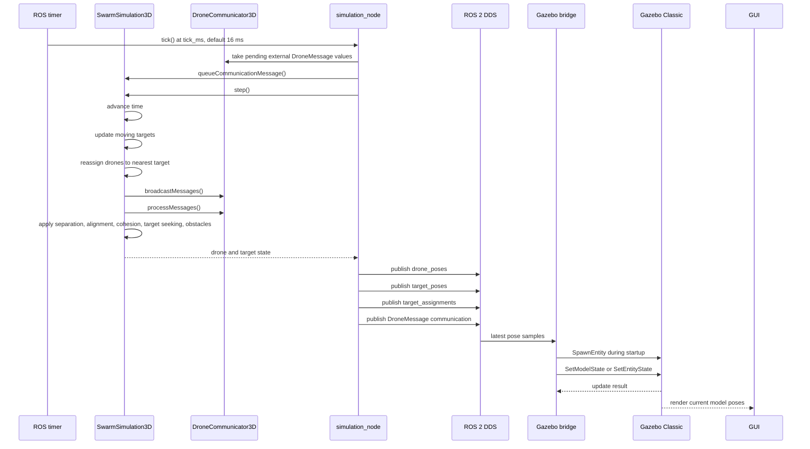
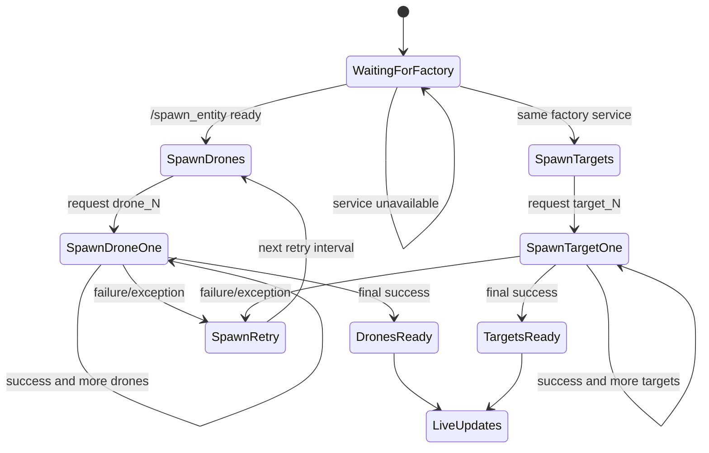
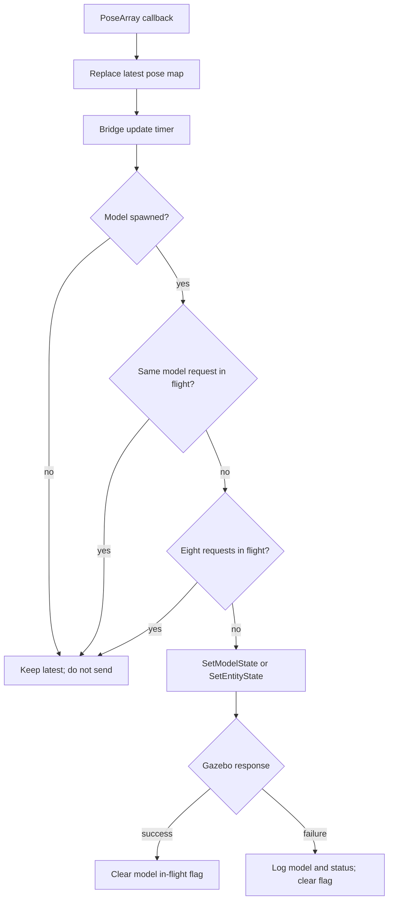

# HiveFlight ROS 2 and Gazebo Implementation

## 1. Scope

This document describes the current ROS 2 integration of HiveFlight. The C++ simulation remains the source of truth for drone and target state. ROS 2 transports the state, and Gazebo Classic renders it. Gazebo is not the flight controller and does not calculate the swarm behavior.

The supported runtime is the workspace at `ros2_ws`. The top-level `ros2/` directory contains an older integration copy and must not be used as the launch source.

## 2. System Architecture

```mermaid
flowchart LR
    subgraph Repo[HiveFlight repository]
        Algorithm[SwarmSimulation3D.cpp\nroot algorithm]
        Grid[SpatialGrid3D.cpp\nneighbor lookup]
        SimNode[simulation_node.cpp\nROS 2 host]
        Adapter[DroneRos2Adapter\ncommunication bridge]
    end

    subgraph ROS[ROS 2 graph]
        Comm[/swarm_N/communication\nDroneMessage]
        Drones[/swarm_N/drone_poses\nPoseArray]
        Targets[/swarm_N/target_poses\nPoseArray]
        Assignments[/swarm_N/target_assignments\nInt32MultiArray]
        GazeboTopics[/gazebo/model_states\nModelStates]
        Spawn[/spawn_entity\nSpawnEntity]
        State[/gazebo/set_model_state\nor set_entity_state]
    end

    subgraph Gazebo[Gazebo Classic]
        World[hiveflight.world\nstate plugin]
        Models[drone_N and target_N\nSDF models]
        GUI[Gazebo GUI]
    end

    Algorithm --> SimNode
    Grid --> Algorithm
    SimNode --> Drones
    SimNode --> Targets
    SimNode --> Assignments
    SimNode --> Adapter
    Adapter --> Comm
    Comm --> Adapter
    Drones --> Bridge[gazebo_swarm_bridge.py]
    Targets --> Bridge
    Assignments --> Bridge
    Bridge --> Spawn
    Bridge --> State
    World --> GazeboTopics
    GazeboTopics --> Bridge
    Spawn --> Models
    State --> Models
    Models --> GUI
```

## 3. Package Structure

| Package/path | Responsibility | Important files |
|---|---|---|
| `HiveFlight/` | Original C++ algorithm and standalone viewers | `SwarmSimulation3D.cpp`, `SwarmSimulation3D.hpp`, `SpatialGrid3D.cpp` |
| `ros2_ws/src/hiveflight_interfaces` | ROS 2 generated message package | `msg/DroneMessage.msg` |
| `ros2_ws/src/hiveflight_sim` | ROS adapter and algorithm library target | `DroneRos2Adapter.cpp`, `DroneCommunication3D.cpp` |
| `ros2_ws/src/hiveflight_sim_node` | ROS node, Gazebo bridge, launch, world, models | `simulation_node.cpp`, `gazebo_swarm_bridge.py` |
| `ros2_ws/build`, `install`, `log` | Generated build/install/runtime artifacts | Never edit manually |

`hiveflight_sim/CMakeLists.txt` intentionally compiles the algorithm sources from the repository root. Moving or renaming those root sources requires updating that CMake file.

## 4. Simulation Tick Workflow



The simulation timer and the Gazebo bridge run in different processes. Their clocks are not synchronized. The bridge deliberately uses latest-only QoS because visualization should display the newest state, not replay stale simulation frames.

## 5. ROS 2 Contracts

### 5.1 Topics

| Topic | Type | Publisher | Subscriber | Meaning |
|---|---|---|---|---|
| `/hiveflight/swarm_<id>/drone_poses` | `geometry_msgs/msg/PoseArray` | `simulation_node` | Gazebo bridge | Array index is the drone index; pose is in `world` frame |
| `/hiveflight/swarm_<id>/target_poses` | `geometry_msgs/msg/PoseArray` | `simulation_node` | Gazebo bridge | Array index is the target index; pose is in `world` frame |
| `/hiveflight/swarm_<id>/target_assignments` | `std_msgs/msg/Int32MultiArray` | `simulation_node` | Gazebo bridge | Element `i` is the target assigned to drone `i` |
| `/hiveflight/swarm_<id>/communication` | `hiveflight_interfaces/msg/DroneMessage` | `DroneRos2Adapter` | `DroneRos2Adapter` instances | Inter-drone communication payload |
| `/gazebo/model_states` | `gazebo_msgs/msg/ModelStates` | Gazebo state plugin | Bridge/diagnostics | Actual models currently known to Gazebo |

Pose arrays use index identity. A missing or reordered pose changes model identity, so producers must preserve stable vector ordering.

### 5.2 `DroneMessage`

```text
int32 sender_id
geometry_msgs/Vector3 position
geometry_msgs/Vector3 velocity
int32 target_id
float32 timestamp
```

The internal `DroneMessage3D` uses `size_t` indices and `double` values. The adapter converts to ROS `int32` and `float32`; deployments should keep drone and target counts within the representable non-negative `int32` range.

## 6. Simulation Model

`SwarmSimulation3D::step()` performs the following operations:

1. Advances simulation time by `dt`.
2. Moves targets along the configured 3D trajectory.
3. Reassigns live drones to their nearest target at the reassignment interval.
4. Rebuilds the 3D spatial grid.
5. Broadcasts and processes internal/external communication.
6. Computes steering forces.
7. Integrates velocity and position.
8. Applies world bounds and battery drain.
9. Commits the next state.

Drone target seeking is computed by `seekTarget(i)`. With one target, every valid drone assignment resolves to target `0`; no ROS message is needed for local target seeking.

## 7. Gazebo Bridge State Machines

### 7.1 Spawn workflow



Spawns are sequential because Gazebo Classic's factory service can lose or delay responses when many spawn requests are sent concurrently. Readiness is set only after all requests in the corresponding batch succeed.

### 7.2 Pose update workflow



The bridge uses a mutex around pose maps, assignment maps, in-flight model names, spawn counters, and readiness flags. This is required because subscriptions, timers, and service completion callbacks run concurrently under the multithreaded executor.

## 8. Rendering Models

The active model files are:

- `models/drone_marker/model.sdf`: one kinematic link containing the fuselage, nose, arms, rotors, collision, and color placeholders.
- `models/target_marker/model.sdf`: one kinematic airplane link with fuselage, nose, main wings, tailplane, vertical stabilizer, light, collision, and color placeholders.

The bridge replaces `__RED__`, `__GREEN__`, and `__BLUE__` before spawning. Target colors are selected by target index. Drone colors are selected using the latest assignment map, with index fallback when assignments have not arrived yet.

Models are kinematic and gravity-free because Gazebo is a visualizer in this phase. Physics should not overwrite algorithm-controlled positions.

## 9. Known Failure Modes

| Symptom | Likely cause | Check |
|---|---|---|
| Gazebo shows only `ground_plane` | Bridge failed, wrong install, or factory unavailable | Bridge startup output; `ros2 service list \| grep spawn_entity` |
| `drone_7 does not exist` | State updates raced spawning or stale bridge is running | Rebuild; wait for `All quadcopters spawned` |
| Target topic changes but target is fixed | Target update service/model name mismatch | `ros2 topic echo /target_poses`; bridge rejection logs |
| `/gazebo/set_model_state` absent | Gazebo state plugin/world not loaded | `ros2 service list`; inspect installed world |
| ROS topic exists but bridge receives nothing | QoS, namespace, or stale executable mismatch | `ros2 topic info -v <topic>` |
| Models appear as old spheres | Existing Gazebo process kept old entities or old SDF was installed | Kill Gazebo, clean rebuild, relaunch |
| Bridge source differs from installed bridge | CMake install artifact is stale | `grep` the installed script and rebuild with `--merge-install` |
| Simulation logs continue but GUI is empty | Simulation and Gazebo are independent; bridge is down | `ros2 node list`, bridge health output |

## 10. Runtime Invariants

The following must be true for a healthy run:

- `simulation_node` publishes non-empty drone and target pose arrays.
- `/spawn_entity` is available before spawning begins.
- Gazebo `/model_states` contains every expected `drone_N` and `target_N`.
- The bridge reports all expected spawn completions.
- Every pose update uses `world` as its reference frame.
- The bridge never queues more than one update per model.
- The algorithm thread never accesses bridge-owned ROS state directly.
